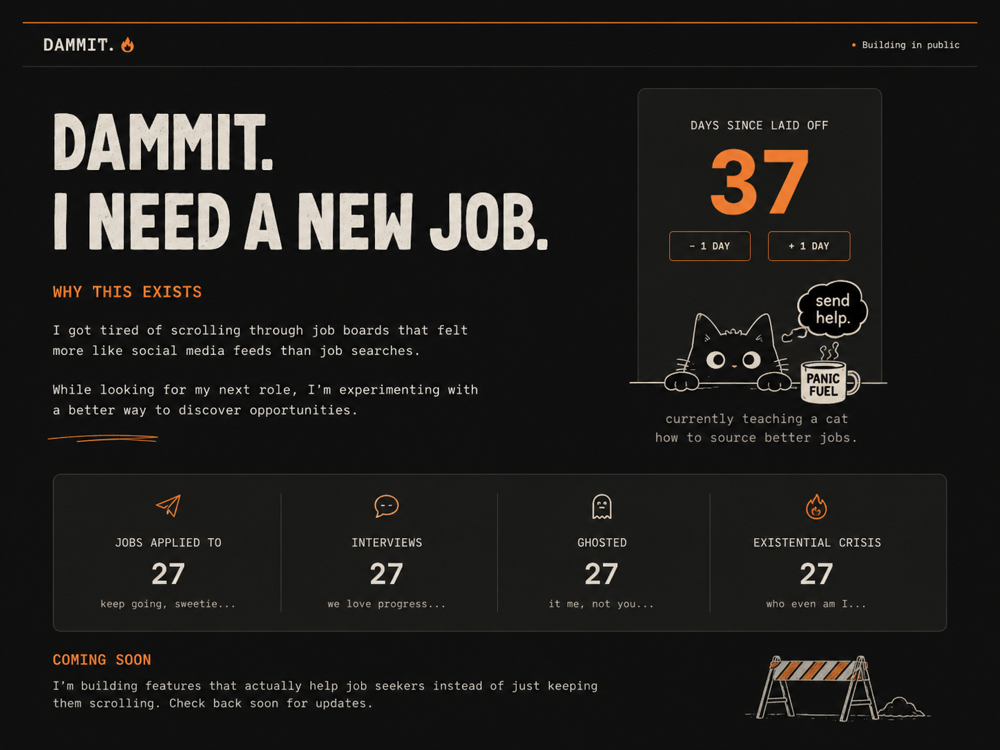
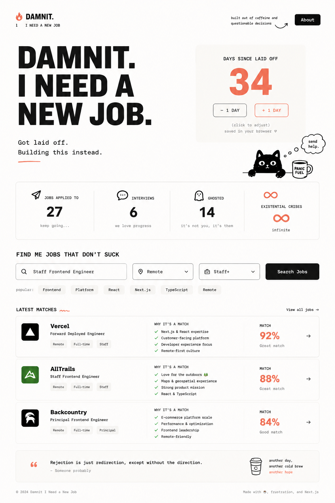

# Dammit, I Need A New Job

A satirical side project inspired by the modern job search experience — and a playground for experimenting with a better way to discover roles.

**Live site:** [dammitigottagetanewjob.com](https://dammitigottagetanewjob.com/)

## The Backstory

This project started after spending time exploring the current landscape of online job boards and realizing that finding relevant opportunities can often feel more difficult than it should.

As I browsed various platforms, I kept running into duplicate listings, sponsored posts, outdated openings, and search results that didn't always align with what I was actually looking for. These platforms provide tremendous reach and visibility, but the experience left me wondering whether there might be simpler, more transparent ways to discover opportunities.

As a software engineer, my natural response to that question wasn't to write down the idea — it was to build something.

## What This Is

At its current stage, this is a fun, satirical take on the job search process. The site doesn't take itself too seriously, and neither should you. The counter, illustrations, and overall tone are meant to capture the universal experience of searching for the next opportunity — whether you're actively looking, casually browsing, or just curious about what's out there.

Underneath the humor is a genuine interest in exploring how job discovery could be improved.

Right now the app includes:

- A responsive landing page
- A persisted days-since-laid-off counter
- Job-search themed status stats
- Local image assets and custom icons
- App-level tests, typecheck, lint, and build scripts

## Mockups

These early design concepts were generated with AI (ChatGPT) to explore the look, tone, and layout before building.

|                                                   Concept — "Building in public"                                                    |                                               Concept — Full landing page                                               |
| :---------------------------------------------------------------------------------------------------------------------------------: | :---------------------------------------------------------------------------------------------------------------------: |
|  |  |

> Note: The mockups above were AI-generated (ChatGPT) and are intended as visual direction. The shipped app may differ.

## Why Build It?

This project also gave me an excuse to experiment with a few technologies and workflows I wanted more hands-on experience with. Some of the goals:

- Building and shipping a small product from idea to deployment
- Gaining more experience deploying applications on Vercel
- Exploring modern frontend tooling and design patterns
- Iterating quickly on a side project without overengineering it
- Having a playground for future ideas related to job discovery and aggregation

## Local Development

Run from the repo root:

```bash
yarn install
yarn workspace dammit-i-need-a-new-job dev
```

The dev server runs at:

```txt
https://localhost:3002
```

## Commands

```bash
# Typecheck this app and its dependencies
yarn turbo typecheck --filter="dammit-i-need-a-new-job..."

# Lint this app and its dependencies
yarn turbo lint --filter="dammit-i-need-a-new-job..."

# Run tests with coverage
yarn turbo test-ci --filter="dammit-i-need-a-new-job..."

# Build for production
yarn turbo build --filter="dammit-i-need-a-new-job..."
```

## Implementation Notes

- The counter uses `@react-hookz/web` and persists to local storage.
- The counter is configured to avoid SSR hydration issues.
- PNG imports are typed with the app-level image declaration file.
- The existential crisis stat is intentionally infinite.
- Typecheck depends on the local icon package build because this app imports generated icon output.

## Vercel

This app is intended to deploy as a standalone Vercel project from:

```txt
apps/dammit-i-need-a-new-job
```

Suggested Vercel settings:

```txt
Framework Preset: Next.js
Root Directory: apps/dammit-i-need-a-new-job
Install Command: yarn install --immutable
Build Command: yarn build
Output Directory: .next
```

## Future Ideas

One direction I'm interested in exploring is aggregating job postings directly from applicant tracking systems such as Greenhouse, Lever, and Ashby.

The goal wouldn't be to replace existing platforms, but to experiment with alternative ways of discovering opportunities that prioritize relevance, transparency, and simplicity.

Whether that becomes a real product or just an excuse to keep drawing increasingly stressed cartoon cats is still to be determined.

## Disclaimer

This project is purely for fun. It's a creative and technical playground built to explore frontend tooling, deployment workflows, and ideas around job discovery — nothing more.

The "new job" framing is purely for laughs — mostly an excuse to draw cats having a worse week than you. Any resemblance to a real existential crisis is purely coincidental.

Probably.
