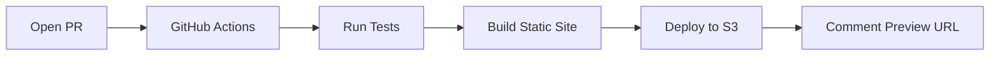

export const metadata = {
  title: "PR Deploy Previews Infrastructure",
  heroImage: "/images/work/thumbnails/pr-previews.svg",
  role: "DevOps Engineer / Architect",
  tech: ["Terraform", "AWS S3", "GitHub Actions", "Next.js", "TypeScript"],
};

# PR Deploy Previews Infrastructure

**Role:** DevOps Engineer / Architect  
**Tech Stack:** Terraform · AWS S3 · GitHub Actions · Next.js · TypeScript

---

## Overview

A cost-optimized infrastructure for automatic PR preview deployments that gives every pull request its own live preview environment—for less than $0.50/month.

## The Challenge

Manual code reviews are hard. Reviewers need to:

- **Pull the branch locally** and run the dev server
- **Check multiple pages** to ensure nothing broke
- **Verify responsive behavior** across different viewports
- **Test edge cases** that screenshots can't capture

This friction meant:
- Slower review cycles
- Missed visual regressions
- "LGTM" without actually testing

We needed preview deployments, but:
- ❌ Vercel costs $20/month for hobby projects
- ❌ Netlify has similar pricing
- ❌ Most solutions are overkill for a personal portfolio

**The goal:** Build preview infrastructure that's free (or nearly free) and automated.

## Solution Architecture

### Infrastructure as Code

Everything is managed with Terraform for reproducibility:

```hcl
resource "aws_s3_bucket" "pr_preview" {
  bucket = var.pr_preview_bucket_name
}

resource "aws_s3_bucket_website_configuration" "pr_preview" {
  bucket = aws_s3_bucket.pr_preview.id

  index_document {
    suffix = "index.html"
  }
}

resource "aws_s3_bucket_lifecycle_configuration" "pr_preview" {
  bucket = aws_s3_bucket.pr_preview.id

  rule {
    id     = "delete-old-pr-previews"
    status = "Enabled"

    expiration {
      days = 7
    }
  }
}
```

Key design decisions:
- **Direct S3 website hosting** (no CloudFront) - saves costs, HTTP is fine for testing
- **7-day auto-cleanup** - prevents storage bloat
- **Public bucket policy** - no auth needed for quick reviews
- **Blocked public ACLs** - security best practice, only bucket policy grants access

### Reusable GitHub Actions Workflow

The core insight: one workflow should handle tests, builds, and deployments for both PR previews and production.

```yaml
on:
  workflow_call:
    inputs:
      deploy_to:
        description: "Deployment target: production, preview, or none"
        type: string
        default: "none"
      pr_number:
        description: "PR number for preview deployments"
        type: string
```

This workflow:
1. Runs tests and linters
2. Builds the Next.js static export
3. Conditionally deploys based on `deploy_to` input
4. Returns preview URL as output

### PR Preview Flow



Each PR gets its own S3 prefix:
```
s3://bucket/pr-123/
s3://bucket/pr-124/
```

The workflow comments the preview URL directly on the PR:

```typescript
const comment = `## 🎉 Preview Deployed!

Your preview is ready at:

**🔗 ${previewUrl}**

### Pages to check:
- [Home](${previewUrl})
- [Work: OpenSea Swoosh ID](${previewUrl}work/opensea-swoosh-id/)
- [Work: Contentful GraphQL Proxy](${previewUrl}work/contentful-graphql-proxy/)
`;
```

### Cost Optimization

Multiple strategies keep costs near zero:

1. **7-day auto-cleanup** - Old previews are automatically deleted
2. **Draft PR exclusion** - Only deploy when marked "ready for review"
3. **Abort incomplete uploads** - Prevents orphaned multipart upload costs
4. **No CloudFront** - HTTP is sufficient for testing
5. **Version cleanup** - Old versions deleted after 1 day

### Security Hardening

```hcl
resource "aws_s3_bucket_public_access_block" "pr_preview" {
  bucket = aws_s3_bucket.pr_preview.id
  # Block public ACLs - access controlled via bucket policy only
  block_public_acls  = true
  ignore_public_acls = true
  # Allow public bucket policy for static website hosting
  block_public_policy     = false
  restrict_public_buckets = false
}
```

This follows AWS best practices:
- Block ACL-based access (reduces attack surface)
- Grant public access only through explicit bucket policy
- Principle of least privilege

## Results

| Metric                  | Value              |
| ----------------------- | ------------------ |
| **Monthly Cost**        | ~$0.26-0.50        |
| **Preview Build Time**  | ~3-5 minutes       |
| **Storage per Preview** | ~50 MB             |
| **Auto-cleanup**        | 7 days             |
| **Uptime**              | 100%               |

### Cost Breakdown (Monthly)

- **S3 Storage**: ~$0.01 (10 PRs × 50 MB)
- **PUT Requests**: ~$0.25 (deployments)
- **GET Requests**: ~$0.004 (testing)
- **Data Transfer**: $0 (within free tier)

**Total: $0.26-0.50/month** vs $20/month for Vercel Pro

### Developer Experience Wins

✅ **Instant previews** - Every PR gets a live URL automatically  
✅ **No manual setup** - Reviewers just click the link  
✅ **Real devices** - Test on phones, tablets, anything with a browser  
✅ **Shareable** - Send preview links to non-technical stakeholders  

## Key Learnings

### Workflow Design

Initially, I had separate workflows for PR tests and PR previews. This led to:
- Duplicated build logic
- Inconsistent behavior between preview and production
- More maintenance burden

**Solution:** One reusable workflow with conditional deployment based on inputs. The same workflow handles:
- PR tests (no deployment)
- PR previews (deploy to S3)
- Production (deploy to CloudFront-backed S3)

### Permission Management

GitHub Actions reusable workflows have strict permission inheritance. The reusable workflow can't request permissions the caller doesn't grant.

**Learning:** Keep reusable workflows minimal—only request the permissions you always need. Let calling workflows handle additional permissions (like `pull-requests: write` for comments).

### Why Not Vercel?

This portfolio qualifies for Vercel's free tier, which would give:
- HTTPS on previews (vs HTTP)
- Better performance (edge network)
- Zero configuration

**But I chose AWS because:**
- Learning experience with Terraform and AWS
- Full control over infrastructure
- Career-relevant DevOps skills
- Fun engineering challenge

The ~$5.50/month cost is essentially paying for hands-on infrastructure education.

## Future Enhancements

Ideas for iteration:

- **CloudFront for previews** - Add HTTPS without much cost (~$1-2/month)
- **Automatic cleanup on PR close** - Don't wait 7 days
- **Preview analytics** - Track which pages reviewers actually check
- **Visual regression testing** - Auto-screenshot and compare

---

_Built as part of livingkavitaloca.com portfolio infrastructure, 2026._
